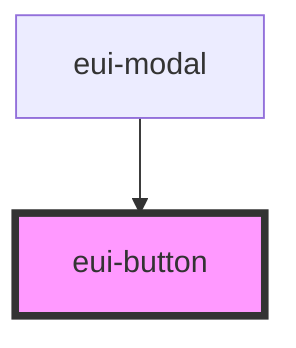

# eui-button

<!-- Auto Generated Below -->

## Properties

| Property    | Attribute    | Description | Type     | Default       |
| ----------- | ------------ | ----------- | -------- | ------------- |
| `classes`   | `classes`    |             | `any`    | `undefined`   |
| `color`     | `color`      |             | `string` | `'lightgray'` |
| `fontColor` | `font-color` |             | `any`    | `undefined`   |
| `fullwidth` | `fullwidth`  |             | `any`    | `undefined`   |
| `onClick`   | `on-click`   |             | `any`    | `undefined`   |
| `padding`   | `padding`    |             | `any`    | `undefined`   |
| `styles`    | `styles`     |             | `any`    | `undefined`   |
| `text`      | `text`       |             | `any`    | `undefined`   |
| `type`      | `type`       |             | `any`    | `undefined`   |
| `variant`   | `variant`    |             | `any`    | `undefined`   |

## Dependencies

### Used by

 - [eui-modal](../eui-modal)

### Graph

----------------------------------------------

*Built with [StencilJS](https://stenciljs.com/)*
