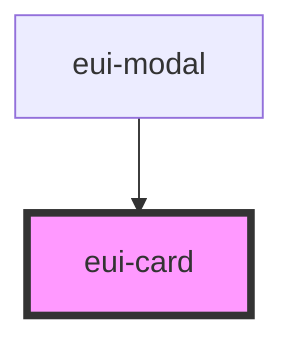

# eui-card

<!-- Auto Generated Below -->

## Properties

| Property      | Attribute       | Description | Type  | Default     |
| ------------- | --------------- | ----------- | ----- | ----------- |
| `iconBgColor` | `icon-bg-color` |             | `any` | `undefined` |
| `title`       | `title`         |             | `any` | `undefined` |
| `variant`     | `variant`       |             | `any` | `undefined` |

## Dependencies

### Used by

 - [eui-modal](../eui-modal)

### Graph

----------------------------------------------

*Built with [StencilJS](https://stenciljs.com/)*
