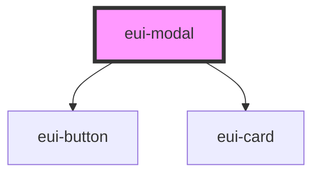

# eui-modal

<!-- Auto Generated Below -->

## Properties

| Property | Attribute | Description | Type  | Default     |
| -------- | --------- | ----------- | ----- | ----------- |
| `open`   | `open`    |             | `any` | `undefined` |
| `title`  | `title`   |             | `any` | `undefined` |

## Dependencies

### Depends on

- [eui-button](../eui-button)
- [eui-card](../eui-card)

### Graph

----------------------------------------------

*Built with [StencilJS](https://stenciljs.com/)*
